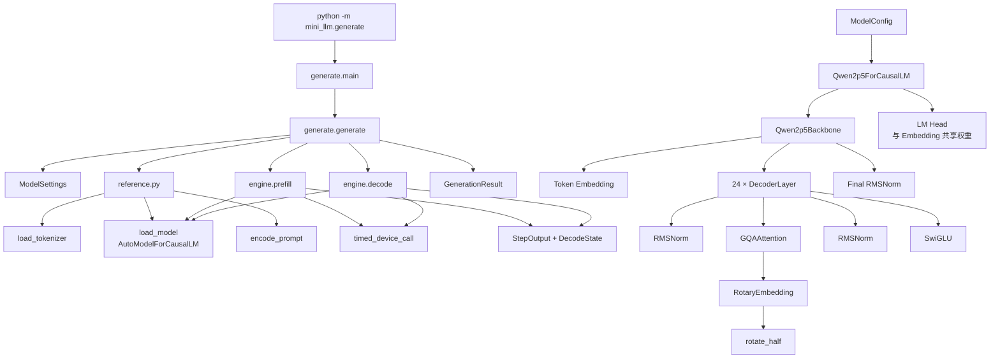

# AI Infra Learning

一个从零实现 mini vLLM 的学习工程。目标模型固定为 `Qwen/Qwen2.5-0.5B-Instruct@7ae5576`，逐步实现模型结构、权重加载、KV Cache、Continuous Batching、Paged Attention、Triton Kernel、CUDA Graph 和 Tensor Parallel。

## 目录结构

```text
.
├── mini_llm/
│   ├── config/                   # 模型、引擎与采样配置
│   ├── layers/
│   │   ├── rms_norm.py           # RMSNorm
│   │   ├── rotary_embedding.py   # Qwen2.5 RoPE
│   │   ├── attention.py          # 完整序列 GQA Attention
│   │   ├── mlp.py                # SwiGLU
│   │   └── decoder_layer.py      # Qwen2.5 Decoder Layer
│   ├── models/
│   │   └── qwen2p5.py            # 完整 Qwen2.5 模型骨架
│   ├── engine/
│   │   ├── prefill_decode.py     # Hugging Face 基线的 Prefill/Decode
│   │   └── state.py              # 基线生成状态与输出类型
│   ├── kernels/                  # 后续 Triton Kernel
│   ├── utils/
│   ├── generate.py               # Hugging Face 单请求 greedy 基线
│   ├── preflight.py              # CUDA、BF16 与本地模型检查
│   ├── reference.py              # Hugging Face 正确性基线
│   └── __init__.py
├── tests/                        # 配置、算子、单层和完整模型测试
├── docs/                         # 学习笔记
├── mha_mqa_lab/                  # MHA/MQA 数学、KV Cache 与带宽实验
├── qwen2p5.py                    # 单文件的详细推理观察脚本
├── pyproject.toml
└── README.md
```



## 核心推理链路

### Hugging Face Oracle

`mini_llm.generate` 使用 Hugging Face `AutoModelForCausalLM` 加载本地权重，并显式拆分推理过程：

```text
Prompt → Chat Template → Token IDs → Prefill → KV Cache
       → 逐 token Decode → greedy argmax → EOS / max_new_tokens
```

这条路径是后续实现的正确性基线，不是最终推理后端。

### 自定义 Qwen2.5

`mini_llm.models.Qwen2p5ForCausalLM` 已实现完整无 Cache 前向：

```text
Token IDs
  → Token Embedding
  → 24 × Decoder Layer
      → RMSNorm
      → GQA Self-Attention + RoPE
      → Residual
      → RMSNorm
      → SwiGLU MLP
      → Residual
  → Final RMSNorm
  → Shared LM Head
  → Logits
```

## 基础知识

```shell
────────────────────────────────────────

             AI Application
                   │
              HTTP Server
                   │
             LLM Engine
                   │
        ┌──────────┴───────────┐
        │                      │
    Scheduler             KV Cache
        │                      │
        └──────────┬───────────┘
                   │
              Model Runner
                   │
────────────────────────────────────────
               [Project]  # GPU 很贵，我怎样让它一直有有用的工作可做？
────────────────────────────────────────
                   │
                PyTorch
                   │
          Triton / CUDA Kernel
                   │
           GPU Hardware
────────────────────────────────────────
               [Project]  # 对于一次具体计算，我怎样让 GPU 更高效地执行？
────────────────────────────────────────
```

- 基础算子参考 [GitHub | Euler0525/leetgpu-challenges](https://github.com/Euler0525/leetgpu-challenges)

### 术语

- 预热 `warmup`：第一次执行可能包括 library initialization, kernel loading, JIT compilation, cache effects…这些不应该算在 steady-state performance 中，所以性能测试通常是 warmup -> benchmark
- 延迟 `latency`：完成一次任务要多久
- 吞吐量 `throughput`：单位时间完成的工作量

```python
import time
import torch


device = "cuda"

def matmul_time_test(n):
    a = torch.randn(n, n, device=device)
    b = torch.randn(n, n, device=device)

    # warmup
    for _ in range(10):
        c = a @ b

    torch.cuda.synchronize()

    start = time.perf_counter()

    for _ in range(100):
        c = a @ b

    torch.cuda.synchronize()
    end = time.perf_counter()

    print(f"n={n}, average:{(end - start) / 100}")

def main():
    matmul_time_test(1024)
    matmul_time_test(2048)
    matmul_time_test(4096)

if __name__ == "__main__":
    main()

"""
1. warmup 第一次执行可能包括
    - library initialization
    - kernel loading
    - JIT compilation
    - cache effects
上面这些不应该算在 steady-state performance中，所以性能测试通常是 warmup --> benchmark

2. GPU 操作通常是异步的，执行c = a @ b，不代表 GPU 此时已经算完了矩阵乘法，如果不加`torch.cuda.synchronize()`，测到的时间只是 launch kernel 的 CPU 时间，而不是 GPU 真正执行计算的时间.
"""
```

### Decoder Layer

Qwen2.5-0.5B-Instruct 将 Decoder Layer 堆叠 24 次，每一层结构如下：

```plaintext
DecoderLayer
│
├── Attention Block
│   ├── RMSNorm              # 控制数据规模
│   ├── GQA Self-Attention   # 14 个 Q Head、2 个 KV Head、head_dim=64
│   ├── RoPE                 # 只旋转 Q/K，rope_theta=1_000_000
│   └── Residual Connection  # 保留原信息 + 新上下文信息
│
└── FFN Block
    ├── RMSNorm              # 再次稳定数值
    ├── SwiGLU MLP           # 896 → 4864 → 896
    └── Residual Connection  # 保留旧信息 + 新特征
```

先让每个 token 看一遍上下文，再让每个 token 自己做一次非线性加工，将结果传给下一层。数学表达式为：

$$
\begin{aligned}
x' &= x + \mathrm{Attention}(\mathrm{RMSNorm}(x))\\
y  &= x' + \mathrm{MLP}(\mathrm{RMSNorm}(x'))
\end{aligned}
$$

## 环境配置

参考 [Euler0525@Blog | AlamaLinux 安装流程](https://euler0525.github.io/blogs/posts/1dc8999e/)，包括 Linux, Pytorch, NVIDIA Driver CUDA Toolkit 等环境的配置。

- `nvidia-smi`：NVIDIA GPU 的管理工具，用来查看

```shell
GPU utilization
GPU memory
GPU temperature
GPU process
```

- `nvcc`：NVIDIA CUDA Compiler，即 CUDA 编译工具链

## 安装与运行

在仓库根目录安装项目及依赖

```powershell
python -m pip install -e ".[test]"
```

先检查 CUDA、BF16、Tokenizer、配置和指定 revision 的本地模型文件：

```powershell
python -m mini_llm.preflight
```

运行 Hugging Face greedy 生成基线：

```powershell
python -m mini_llm.generate --prompt "Explain KV cache briefly." --max-new-tokens 32
```

模型默认使用 CUDA、BF16 和 `local_files_only=True`，因此需要支持 BF16 的 NVIDIA GPU，且指定 revision 的模型文件必须已缓存在本地。

运行所有测试：

```powershell
python -m pytest tests -q
```

若同步目录不允许 pytest 创建 `.pytest_cache`，可以禁用 cache provider：

```powershell
python -m pytest tests -q -p no:cacheprovider
```

若要观察 Hugging Face 基线的 token、logits、Top 5 候选、KV Cache 和显存峰值，可运行：

```powershell
python qwen2p5.py
```

## 参考资料

- [Qwen/Qwen2.5-0.5B-Instruct](https://huggingface.co/Qwen/Qwen2.5-0.5B-Instruct)
- [Euler0525@Blog | AI Infra](https://euler0525.github.io/blogs/series/AI-Infra/)
