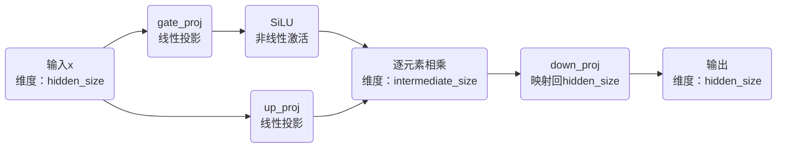

# SwiGLU

Swish 门控线性单元是一种带有门控机制的前馈神经网络结构，将输入分别送入两个不同的线性变换分支，其中一个分支经过 SiLU 激活函数产生门控信号，再将两个分支的输出元素相乘，最后通过一个线性层将结果映射回原始维度。数学表达式为

$$
\begin{aligned}
\mathrm{SwiGLU}(x) &= W_{\mathrm{down}}[\mathrm{SiLU(W_{\mathrm{gate}}x)\odot (W_{\mathrm{up}}x}]\\
\mathrm{SiLU}(x) &= x\sigma(x) = \dfrac{x}{1 + e^{-x}}
\end{aligned}
$$

其中 $W_{\mathrm{gate}},W_{\mathrm{up}},W_{\mathrm{down}}$ 分别表示三个线性层的权重矩阵。计算流程如下

- 门控：让网络根据当前输入，动态调节不同特征的作用
- 分支特征：两个分支权重参数不同，从同一个输入中学习到不同的特征组合。一条路径生成待处理的特征，另一条生成对这些特征的调节信号。
- 逐元素相乘：一个分支产生的数值能够直接控制另一个分支对应特征的幅度。
